<div align="center">

# ⚡ CyberZap

### Automated Cyber Threat Intelligence Pipeline

[](https://n8n.io/)
[](https://www.docker.com/)
[](https://opensource.org/licenses/MIT)

*Stay ahead of threats with AI-powered cyber intelligence, delivered straight to your messaging channels.*

[Features](#-features) • [Architecture](#-architecture) • [Quick Start](#-quick-start) • [Configuration](#%EF%B8%8F-configuration) • [Usage](#-usage)

</div>

---

## 🎯 Overview

**CyberZap** is an automated Cyber Threat Intelligence (CTI) aggregation and triage system built on [n8n](https://n8n.io/). It continuously monitors critical cybersecurity sources, uses AI to analyze and score threats, and delivers actionable alerts to your team via WhatsApp or Telegram.

Perfect for:
- 🏢 **Security Operations Centers (SOC)** - Reduce alert fatigue with AI-powered triage
- 🔒 **Security Teams** - Stay informed on relevant vulnerabilities and ransomware attacks
- 📊 **Threat Intelligence Analysts** - Automate intelligence gathering from multiple sources

---

## ✨ Features

| Feature | Description |
|---------|-------------|
| 🔄 **Multi-Source Aggregation** | CISA KEV, CERT-FR, ZeroDay Initiative, Ransomware.live, and custom RSS feeds |
| 🤖 **AI-Powered Analysis** | LLM-based threat scoring and summarization (OpenAI, Anthropic, or local models) |
| 🎯 **Smart Triage** | Automatic filtering based on scope (France-focused, Fortune 500, critical infrastructure) |
| 📱 **Multi-Channel Alerts** | WhatsApp and Telegram integration for instant notifications |
| 📊 **Google Sheets Backend** | Simple database for tracking and reviewing threats |
| 🌐 **Article Scraping** | Jina AI integration for full article extraction |
| ⏰ **Scheduled Execution** | Configurable polling intervals (15min for critical, 6h for daily digest) |

---

## 🏗 Architecture

```mermaid
flowchart TB
    subgraph Sources["📡 Intelligence Sources"]
        CISA[CISA KEV]
        CERT[CERT-FR]
        ZDI[Zero-Day Initiative]
        RW[Ransomware.live]
        RSS[Custom RSS Feeds]
    end

    subgraph N8N["⚡ n8n Workflow Engine"]
        direction TB
        FETCH[Fetch & Deduplicate]
        SCRAPE[Article Scraper<br/>Jina AI]
        LLM[AI Analyzer<br/>Threat Scoring]
        FILTER[Relevance Filter]
    end

    subgraph Output["📤 Output Channels"]
        WA[WhatsApp Channel]
        TG[Telegram Bot]
        GS[Google Sheets DB]
    end

    Sources --> FETCH
    FETCH --> SCRAPE
    SCRAPE --> LLM
    LLM --> FILTER
    FILTER --> Output

    style N8N fill:#1a1a2e,stroke:#FF6D5A,stroke-width:2px
    style Sources fill:#16213e,stroke:#0f3460
    style Output fill:#16213e,stroke:#0f3460
```



### Workflow Components

1. **Fast Lane** (Every 15 minutes)
   - Monitors CISA KEV for newly exploited vulnerabilities
   - Immediate alerting for critical patches

2. **Standard Lane** (Every 15 minutes)
   - CERT-FR advisories
   - Zero-Day Initiative publications
   - Ransomware.live activity feed

3. **Slow Lane / Daily Harvester** (Every 6 hours)
   - Custom RSS feeds from Google Sheets configuration
   - Deep article analysis for threat intelligence
   - Curated daily digest

---

## 🚀 Quick Start

### Prerequisites

- [Docker](https://docs.docker.com/get-docker/) and [Docker Compose](https://docs.docker.com/compose/install/)
- API keys for your chosen services (see [Configuration](#%EF%B8%8F-configuration))

### Installation

1. **Clone the repository**
   ```bash
   git clone https://github.com/YOUR_USERNAME/cyber-zap-public.git
   cd cyber-zap-public
   ```

2. **Configure environment**
   ```bash
   cp .env.example .env
   # Edit .env with your preferred settings
   nano .env
   ```

3. **Start the services**
   ```bash
   docker compose up -d
   ```

4. **Access n8n**
   
   Open http://localhost:5678 in your browser
   
   Default credentials:
   - Username: `admin`
   - Password: `changeme`

5. **Import the workflow**
   - In n8n, go to **Workflows** → **Import from File**
   - Select `workflow.json` from this repository
   - Configure your credentials (see below)

---

## ⚙️ Configuration

### Environment Variables

| Variable | Description | Default |
|----------|-------------|---------|
| `N8N_BASIC_AUTH_USER` | n8n admin username | `admin` |
| `N8N_BASIC_AUTH_PASSWORD` | n8n admin password | `changeme` |
| `POSTGRES_PASSWORD` | Database password | `n8n_password` |
| `TIMEZONE` | Timezone for scheduling | `Europe/Paris` |

### Required Credentials (Configure in n8n)

After importing the workflow, you'll need to configure these credentials in n8n:

| Credential | Purpose | How to Get |
|------------|---------|------------|
| **OpenAI API** | AI threat analysis | [OpenAI Platform](https://platform.openai.com/api-keys) |
| **Jina AI API** | Article scraping | [Jina AI](https://jina.ai/) (free tier available) |
| **Google Sheets OAuth** | Database storage | [Google Cloud Console](https://console.cloud.google.com/) |
| **Telegram Bot** *(optional)* | Alert delivery | [@BotFather](https://t.me/botfather) |
| **WAHA** *(optional)* | WhatsApp alerts | Self-hosted, see docker-compose |

### Google Sheets Setup

1. Create a new Google Sheet with two tabs:
   - **Sources**: Configure your RSS feeds
   - **Slow Lane**: Where analyzed articles are stored

2. **Sources** tab columns:
   | Name | URL | Enabled |
   |------|-----|---------|
   | Bleeping Computer | https://bleepingcomputer.com/feed/ | true |
   | The Hacker News | https://feeds.feedburner.com/TheHackersNews | true |

3. Share the sheet with your Google OAuth service account

---

## 📖 Usage

### Starting the System

```bash
# Start all services
docker compose up -d

# View logs
docker compose logs -f n8n

# Stop services
docker compose down
```

### Enabling WhatsApp Integration

1. Uncomment the WAHA service in `docker-compose.yml`
2. Start the services: `docker compose up -d`
3. Access WAHA at http://localhost:3000
4. Scan the QR code with WhatsApp
5. Update the workflow with your channel ID

### Customizing Threat Scope

The AI analyzer is pre-configured for:
- 🇫🇷 French companies (CAC40, strategic sectors)
- 🌍 Global Fortune 500 companies
- 🛡️ Critical infrastructure (energy, defense, healthcare)

To customize, edit the system prompt in the "Cyber Threat Analyzer" node.

---

## 📁 Project Structure

```
cyber-zap-public/
├── docker-compose.yml    # Docker orchestration
├── .env.example          # Environment template
├── workflow.json         # n8n workflow (sanitized)
├── .gitignore
└── README.md
```

---

## 🔒 Security Notes

- ⚠️ Change default passwords before deploying
- 🔐 The `workflow.json` has been sanitized - all API keys are placeholders
- 🚫 Never commit `.env` files or `private_workflow.json`
- 🌐 For production, use HTTPS and proper authentication

---

## 🤝 Contributing

Contributions are welcome! Please feel free to submit a Pull Request.

1. Fork the repository
2. Create your feature branch (`git checkout -b feature/AmazingFeature`)
3. Commit your changes (`git commit -m 'Add some AmazingFeature'`)
4. Push to the branch (`git push origin feature/AmazingFeature`)
5. Open a Pull Request

---

## 📄 License

This project is licensed under the MIT License - see the [LICENSE](LICENSE) file for details.

---

## 🙏 Acknowledgments

- [n8n](https://n8n.io/) - Workflow automation platform
- [CISA](https://www.cisa.gov/) - Known Exploited Vulnerabilities catalog
- [CERT-FR](https://www.cert.ssi.gouv.fr/) - French national CERT
- [Ransomware.live](https://www.ransomware.live/) - Ransomware tracking
- [Jina AI](https://jina.ai/) - Article reader API

---

<div align="center">

**Built with ❤️ for the cybersecurity community**

*If this project helps you, consider giving it a ⭐!*

</div>
